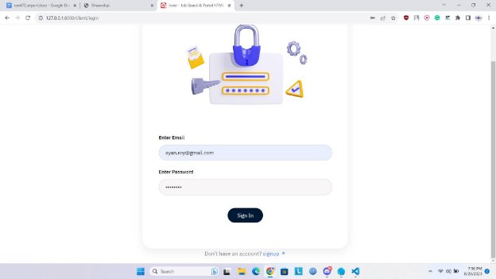
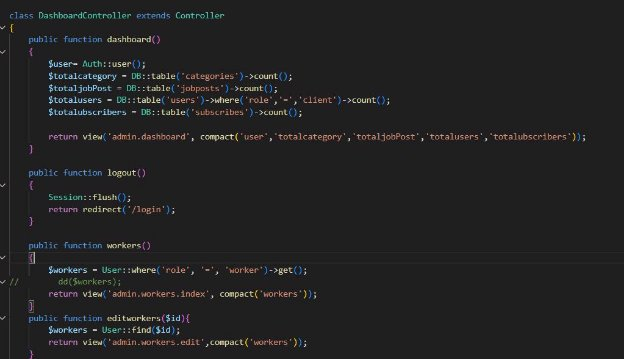
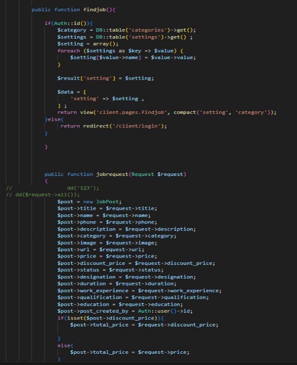

**CSE470 : Software Engineering Project Report**

**Project Title : Shrom**

|**Group No : 9 , Summer 2023**||
| - | :- |
|**ID**|**Name**|
|19201043|Ayan Roy|

32

**Table of Contents**

|**Section No**|**Content**|
| :-: | - |
|1|Introduction|
|2|Functional Requirements|
|3|User Manual|
|4|Frontend Development|
|5|Backend Development|
|6|Technology (Framework, Languages)|
|7|Github Repo Link|

**Introduction**

The Shrom platform aims to create a user-friendly digital marketplace, linking service providers and customers seamlessly. This platform simplifies the process of offering, managing, and accessing services, with features like dynamic pricing and transaction oversight. The customers also have access to features such as a digital payment system to reduce any hassle of using the site and make the method of purchasing services seamless. This document outlines the essential requirements guiding the development and implementation of the user-centered Shrom platform.

**Functional Requirements**

1. **Admin**
- Admins can view/edit all categories
- Admins can view/edit job posts
- Admins can disable and enable Workers/Customers
- Admins can disable and enable any services
- Admins can set discounts on services
- Admins can check ongoing purchases
- Admins can edit the front page to their liking
2. **Workers**
- Workers can view/edit their categories
- Workers can view/edit their job posts
- Workers can message admins through WhatsApp
- Workers can set discounts on services
- Workers can upload pictures for their Jobposts
3. **Customers**
- Customers can view all Jobposts
- Customers can search by categories
- Customers can browse Jobposts
- Customers can subscribe for notifications
- Customers can view their profile
4. **Payment System**
- Customers can add/remove Jobs to their cart
- Customers can view the total amount of their purchase
- Customers can use an online banking system or Bkash/Nagad

**User Manual**

1. **User Side**
1. **Homepage**
- On Homepage, User can Login as User by clicking on “Login” Button and register as User by clicking on “Register” Button

- User Can Also Browse the Jobs without Login

2. **Login Page**
- User can fillup the form to Login

- User can Fillup the form to register

3. **Job List**
- User can View all the Jobs from this page

4. **Browse Job**
- User can see the Job details and Click “Apply” to add Job to Cart

5. **Cart**
- User can click “Hire Worker” to purchase the services and See the total amount in Cart

6. **Payment System**
- Users can Press to “hire work” they will be taken to a payment system implemented by /sandbox.sslcommerz.com

- There will be options for various mobile bankings

2. **Worker Side**
1. **Login**
- Worker can fillup the form to Login

![ref1]

- Worker can fillup the form to Register

2. **Category**
- Worker can view all categories and edit them

![ref2]

- Worker can add categories

![ref3]

3. **JobPost**
- Worker can see their own Jobposts and edit them

![ref4]

- Worker can create Jobposts
- ![ref5]
3. **Admin Side**
1. **Login**
- Admin can Login into the Admin Panel

![ref1]

2. **Dashboard**
- Admin can View the DashBoard

3. **Category**
- Admin can view categories and also edit them

![ref2]

- Admin can Create categories to their liking

![ref3]

4. **JobPost**
- Admin can see all Jobposts And also create them

![ref4]

![ref5]

5. **All Orders**
6. **Subscribers**
- Admin can view all Subscribers

7. **All Workers and Users**
- Admin can view all Workers and Users and choose to disable or enable their account

**Frontend Development**

In the directory named “/resources/views”, we have stored the code for the template that we have mastered.

 

In the screenshots below, we will see that we have used Yield option in laravel in both admin and main template so that it can be used to define the section in a particular layout and is consistently used to retrieve content from the child page to a master page. So if the Laravel executes a blade file, it just verifies if the user has the extended layout and then pushes the master layout which commences from getting the @section

**Backend Development**

1. **Admin can create/remove services:**
- **admin can edit workers**

- **Admin can destroy workers , edit users , update users , destroy users , destroy subscribers**

- **Admin can synchronize , update and cancel orders**

**The routes file will be helping us for admin panel navigation.For example,in this screenshot we can several routes for how an admin can check pages dashboard,category,slider and all workers.**

**Controllers will help an admin with the logics behind various pages.In this above screenshot,we can see the CategoryController.php which will handle all the logics behind category page such as adding/removing/editing categories.**

**This screenshot is indicating the database for the subscribers.This will fall under the category known as model for this project.Admin will have to access this database-”subscribe.php” to get updates about subscribers.**

2. **Workers :**
- **workers can create a job offer with their specific informations and requirements**

- **Worker can request for job or search for specific jobs**
- 

**4.**

**Cart class mainly creates relation between jobpost items and the user items from the database through job\_id and user\_id**

**Add\_cart module is used to save a job\_post to the cart selected by a specific client who is authorized . If the client is authorized then this process completes otherwize it redirects to login**

**View cart module connects with setting database and then shows the saved items in cart table . Also delete module drops specific id from the cart table .**

**Index module will calculate the total payment for selected job**

**$data variable stores the specific information about the client**

**If the payment is successful the the “Success” module is executed**

**Otherwise fail module is executed**

**And lastly it can be canceled using cancel module**

**Technology (Framework, Languages)**

Framework: Laravel

**Github Repository**

Link: https://github.com/AyanRoy02/Shrom

[ref1]: img/Aspose.Words.ce6dc14c-e78c-4064-a4e7-b5c5d3fc7041.011.jpeg
[ref2]: img/Aspose.Words.ce6dc14c-e78c-4064-a4e7-b5c5d3fc7041.013.jpeg
[ref3]: img/Aspose.Words.ce6dc14c-e78c-4064-a4e7-b5c5d3fc7041.014.jpeg
[ref4]: img/Aspose.Words.ce6dc14c-e78c-4064-a4e7-b5c5d3fc7041.015.jpeg
[ref5]: img/Aspose.Words.ce6dc14c-e78c-4064-a4e7-b5c5d3fc7041.016.jpeg